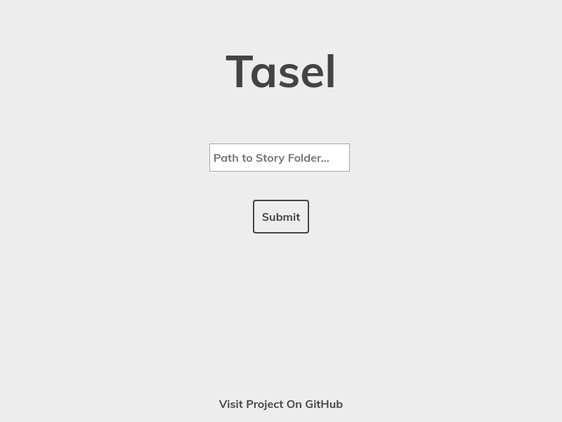

# Tasel 🎓

## Electron implementation of tasc player, pronounced like ***tassel***

***Project for use with the [tasc](https://github.com/drewrip/tasc) compiler***

This was developed in conjunction with tasc. Its goal is to create a platform for playing and writing interactive stories. Tasel is the first UI player for tasc stories, and was made to be the first step in increasing the ease of use of the platform.

### Quick Start:

Enter the path to the directory of the compiled story. This will prompt you with the information of the story. Click ***next*** to move to the first page of the story. After going throught the story, clicking the final button ***RETURN TO MENU*** will take you back to the main story selection screen.
_____
**Feel free to submit a PR or contact me if you are interested in contributing. Writers also welcome for beta testing!**
